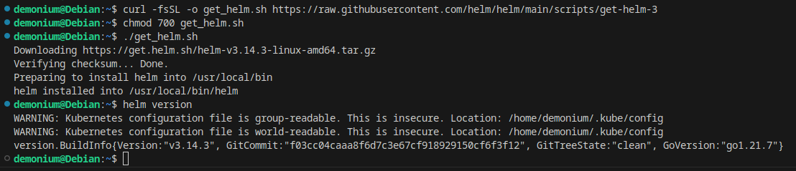
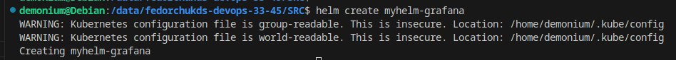
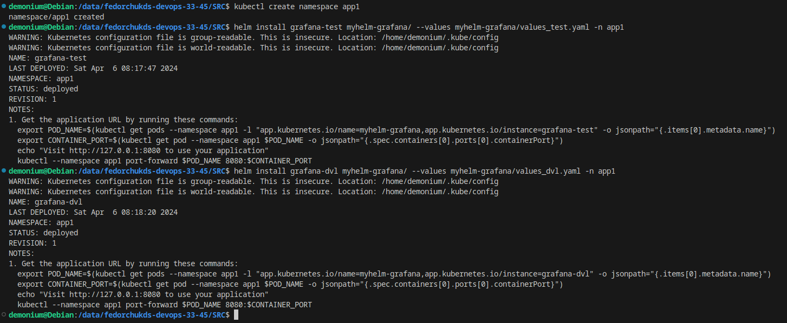
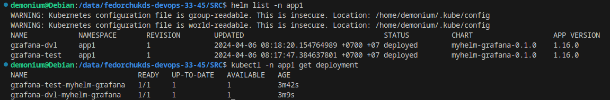
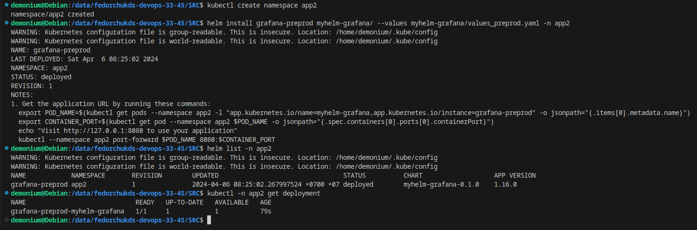
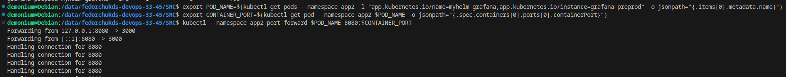
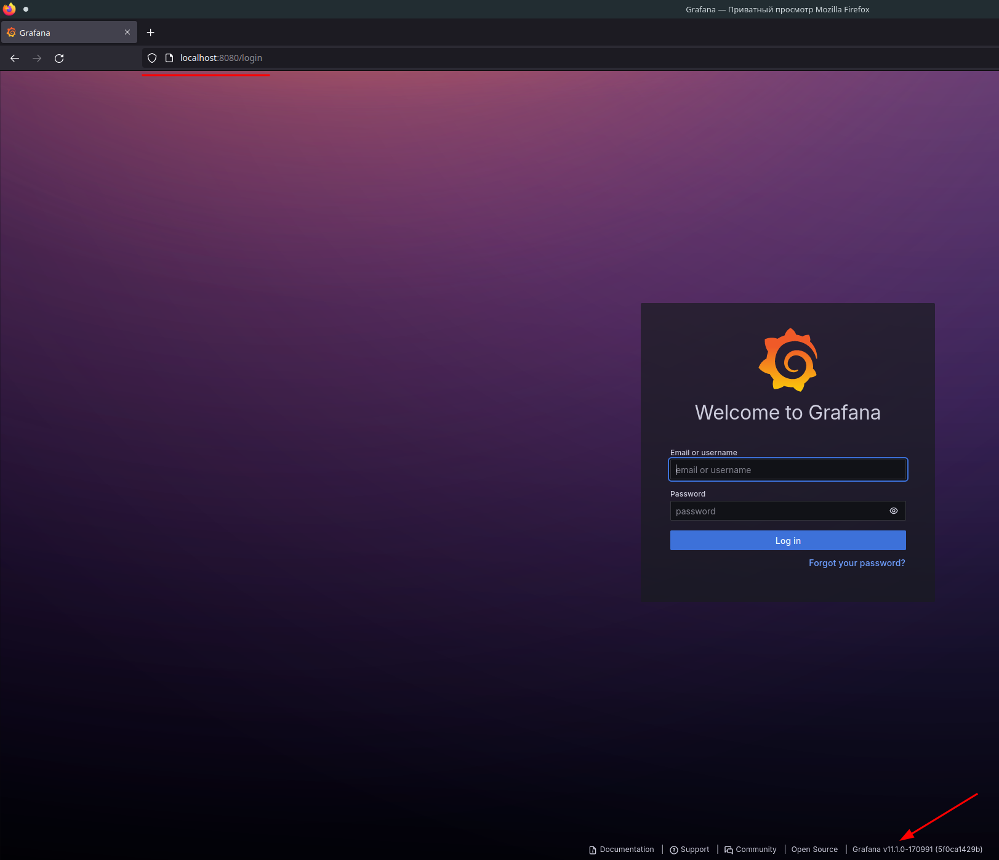

# Автор: Федорчук Дмитрий Сергеевич DEVOPS-33

# Домашнее задание к занятию «Helm»

### Задание 1. Подготовить Helm-чарт для приложения

1. Необходимо упаковать приложение в чарт для деплоя в разные окружения. 
2. Каждый компонент приложения деплоится отдельным deployment’ом или statefulset’ом.
3. В переменных чарта измените образ приложения для изменения версии.

------
### Задание 2. Запустить две версии в разных неймспейсах

1. Подготовив чарт, необходимо его проверить. Запуститe несколько копий приложения.
2. Одну версию в namespace=app1, вторую версию в том же неймспейсе, третью версию в namespace=app2.
3. Продемонстрируйте результат.

------

### Выполнение задания 1. Подготовить Helm-чарт для приложения

1. Для начала установлю на ноду Helm используя скрипт:

Создаю собственный helm chart с именем `myhelm-grafana`:

2 - 3. Создаю два файла Values - `values_dvl.yaml` и `values_test.yaml` для DEVELOP и TEST окружения, дописываю в них необходимые параметры для запуска Grafana, такие как имя образа, тег, порт. Приложения будут развернуты отдельными Deployment.

------

### Выполнение задания 2. Запустить две версии в разных неймспейсах

1 - 3. Создам отдельный Namespace с именем app1, запущу обе версии приложения в этом Namespace:

Проверю результат:

Приложения действительно развернуты с помощью Helm в виде отдельных Deployments.

Разверну еще одну версию приложения, но уже в Namespace app2:

Приложение также успешно развернуто.

Между собой приложения отличаются версиями образов, указанных в тегах.

Для проверки работоспособности Grafana проброшу порт и проверю, откроется ли Web-интерфейс приложения:

Запустилась последняя на данный момент версия Grafana v11.1.0, что соответствует указанному в файле переменных `values_preprod.yaml` тегу `main`.